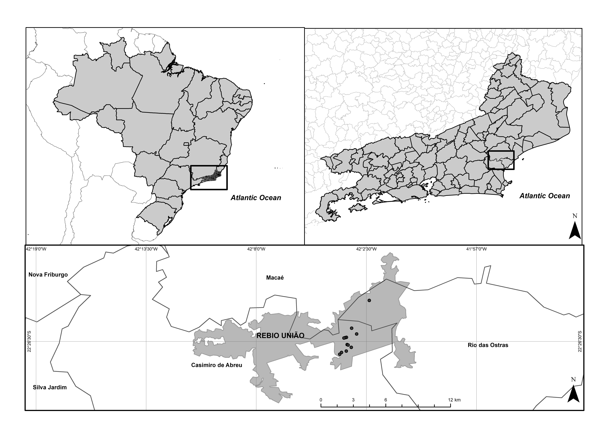
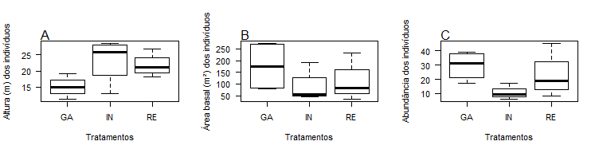

```{r setup, include=FALSE}
knitr::opts_chunk$set(echo = TRUE)
```
## Introdução

Uma das mais significativas mudanças nas florestas tropicais em decorrência da fragmentação florestal é o aumento na densidade das lianas (Putz 1984; Philips et al. 2002; Schnitzer e Bongers 2011; Magrach et al. 2014; Campbell et al. 2015, 2018). Este aumento se deve a enorme capacidade das lianas de se estabelecerem em condições adversas, como estresse hídrico e alta incidência de luz, características comuns em ambientes que sofreram algum distúrbio (Putz 1984; Jones et al. 2017; Mohandass et al. 2017; Schnitzer 2018), como as bordas dos fragmentos florestais.
  
No caso das aberturas lineares de dossel, como gasoduto e linha de transmissão de rede elétrica, acredita-se que a largura dessas aberturas (Laurance et al. 2009; Addo-Fordjour & Owusu-Boadi 2016; Ofosu-Bamfo et al. 2019) e o grau de vedação das bordas (Pohlman et al. 2007) sejam fatores relevantes para determinar a intensidade do efeito de borda sobre as comunidades vegetais. 
    
Tendo em vista o aumento na densidade de lianas e o importante papel desempenhado por elas na manutenção dos ecossistemas florestais (Durigon et al. 2014; Campbell et al. 2018; Yang et al. 2018), os estudos com este grupo contribuem significativamente para a compreensão dos impactos da fragmentação nas florestas tropicais (Arroyo-Rodríguez & Toledo-Aceves 2009). 
  
## Objetivo

Avaliar o efeito de borda sobre a estrutura das comunidades de lianas que ocorrem em bordas de aberturas lineares de dossel, em um fragmento da Floresta Atlântica.

## Hipótese

  As comunidades de lianas nas bordas das aberturas lineares são mais abundantes, apresentam menor altura e área basal similar às comunidades de lianas do interior do fragmento florestal.

## Material e métodos

### Área de estudo

Este estudo foi realizado na Reserva Biológica União, localizada na baixada litorânea do estado do Rio de Janeiro, abrangendo os municípios de Rio das Ostras, Casimiro de Abreu e Macaé (22º25’40”S e 42º02’06”W). A Reserva é cortada por uma linha de transmissão de rede elétrica e um gasoduto, formando duas aberturas de dossel lineares distintas do interior do fragmento florestal. A linha de transmissão de rede elétrica apresenta cerca de 100 m de largura e o gasoduto possui cerca de 25 m de largura (Prieto et al. 2014).



### Coleta de dados

Foram distribuídas quatro parcelas no interior do fragmento florestal (a 500 m da borda para o interior (IN)), quatro parcelas nas bordas adjacentes à abertura linear mais estreita (gasoduto (GA) – 25 m) e quatro nas bordas adjacentes à abertura linear mais larga (rede elétrica (RE) – 100 m) (Figura 2), aonde foi realizado o levantamento de todos os indivíduos com DAB (diâmetro na altura da base) ≥ 2,5 cm. Todos os indivíduos foram contabilizados, tiveram sua altura estimada e seu diâmetro medido.


### Análise de dados

Foi realizada uma análise exploratória calculando-se a média dos parâmetros estruturais (abundância, altura e área basal) por tratamento. Em seguida estes dados foram inseridos em um gráfico do tipo boxplot para melhor leitura dos dados. 
  
## Resultados

É possível obeservar maior semelhança na estrutura das comunidades de lianas entre o interior e a borda da rede elétrica, que é a borda mais larga (Figura 3). Por outro lado, as comunidades da borda do gasoduto que é a mais estreita, parece se diferenciar mais tanto da borda mais larga, quanto do interior. Apesar da borda da rede elétrica ser mais larga, ela é mais antiga. Desta forma, este resultado pode indicar que as comunidades de lianas estão caminhando para uma condição mais próxima do que era encontrado anteriormente na área de estudo. Assim, a borda do gasoduto que é mais recente está mais distante do retorno às condições semelhantes à formação florestal original. Portanto, pode-se sugerir que o tempo de criação das aberturas lineares de dossel é um fator mais importante na dinâmica dessas comunidades de lianas do que a largura das aberturas.



## Referências

Addo‐Fordjour, P., & Owusu‐Boadi, K. 2016. Linear edge effects on liana and tree communities in  two  tropical  forest  ecosystems  in  Ghana. Ecological   research, 31(5), 709-718.

Arroyo‐Rodríguez, V., & Toledo‐Aceves, T. 2009. Impact of landscape spatial pattern on liana communities in tropical rainforests at Los Tuxtlas, Mexico. Applied Vegetation Science, 12(3), 340-349.

Campbell, M., Laurance, W. F., & Magrach, A. 2015. Ecological effects of lianas in fragmented forests. Ecology of lianas, 443-450.

Campbell, M. J., Edwards, W., Magrach, A., Alamgir, M., Porolak, G., Mohandass, D., & Laurance, W. F. 2018. Edge disturbance drives liana abundance increase and alteration of liana–host tree interactions in tropical forest fragments. Ecology and evolution, 8, 4237-4251.

Durigon, J.; Miotto, S. T.; & Gianoli, E. 2014. Distribution and traits of climbing plants in subtropical and temperate South America. Journal of vegetation science 25, 1484- 1492.

Jones, I. L., Peres, C. A., Benchimol, M., Bunnefeld, L., & Dent, D. H. 2017. Woody lianas increase in dominance and maintain compositional integrity across an Amazonian dam-induced fragmented landscape. PloS one, 12, e0185527.

Laurance, W. F., Goosem, M., & Laurance, S. G. 2009. Impacts of roads and linear clearings on tropical forests. Trends in ecology & evolution, 24(12), 659-669.

Magrach, A., Rodríguez‐Pérez, J., Campbell, M., & Laurance, W. F. 2014. Edge effects shape the spatial distribution of lianas and epiphytic ferns in Australian tropical rain forest fragments. Applied Vegetation Science, 17, 754-764.

Mohandass, D., Campbell, M. J., Hughes, A. C., Mammides, C., & Davidar, P. 2017. The effect of altitude, patch size and disturbance on species richness and density of lianas in montane forest patches. Acta oecologica, 83, 1-14.

Ofosu-Bamfo, B., Addo-Fordjour, P., & Belford, E. J. 2019. Does road-edge affect liana community structure and liana-host interactions in evergreen rainforests in Ghana?. Acta Oecologica, 101, 103476.

Phillips, O. L.; Martínez, R. V.; Arroyo, L.; Baker, T. R.; Killeen, T.; Lewis, S. L., Malhi, Y.; Mendoza, A. M.; Neillq, D.; Vargas, P. N.; Alexiades, M.; Cerón, C.; Di Fiore, A.; Erwinkk, T.; Jardim, A.; Palaciosq, W.; Saldias, M. & Vinceti, B. 2002. Increasing dominance of large lianas in Amazonian forests. Nature, 418(6899), 770.

Pohlman, C. L., Turton, S. M., & Goosem, M. 2007. Edge effects of linear canopy openings on tropical rain forest understory microclimate. Biotropica, 39(1), 62-71. 

Prieto, P. V.; Sansevero, J. B.; Garbin, M. L.; Braga, J.; & Rodrigues, P. J. 2014. Edge effects of linear canopy openings on understorey communities in a lowland Atlantic tropical forest. Applied Vegetation Science 17, 121-128.

Putz, F. E.  1984.  The  natural  history  of  lianas  on  Barro  Colorado  Island, Panama. Ecology 65, 1713-1724.

Schnitzer, S. A. & Bongers, F. 2011. Increasing liana abundance and biomass in tropical forests: emerging patterns and putative mechanisms. Ecology letters 14, 397-406.

Schnitzer, S. A. 2018. Testing ecological theory with lianas. New Phytologist, 220, 366- 380.

Yang, S. Z., Fan, H., Li, K. W., & Ko, T. Y. 2018. How the diversity, abundance, size and climbing mechanisms of woody lianas are related to biotic and abiotic factors in a subtropical secondary forest, Taiwan. Folia geobotanica, 53, 77-88.

